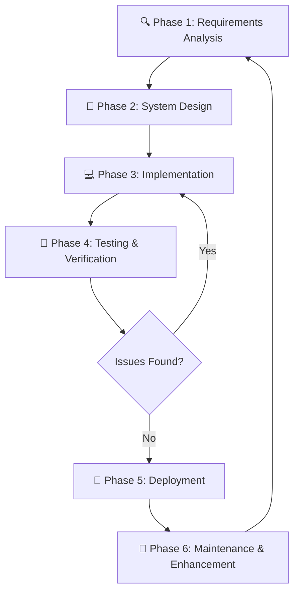

# 01 — SDLC Methodology and Framework
## GameKhansa (Mobil Legend) — Educational Racing Game

---

## 1. Project Overview

**Project Name:** GameKhansa — Mobil Legend Educational Racing Game  
**Version:** 2.0  
**Platform:** Dual-Platform — Python/Pygame (Desktop) + HTML5 (Browser)  
**Target Users:** Indonesian Primary School Students (SD Kelas 1–6, Age 7–12)  
**Educational Domains:** Mathematics (Grade-adaptive) + English Vocabulary (3,000 words, 3 levels)  
**Repository:** `/Users/imamasrowardi/.../GameKhansa/`

### 1.1 Project Description

GameKhansa is an educational action-racing game that integrates curriculum-aligned quiz mechanics into a compelling vehicular arcade experience. Players control a racing car or tank through 4 lanes of traffic, encountering quiz gate portals every 8–10 seconds. Correct answers unlock a spectacular "Super Celebration Reward" (Rainbow Star Shield immunity, coins, HP, mega boost, confetti), while wrong answers trigger an impassable barrier forcing re-engagement with the question. The game targets the Kurikulum Merdeka (Merdeka Belajar) competency framework and covers:

- **Mathematics:** All six SD grades (Kelas 1–6) with scaffolded arithmetic, geometry, and number pattern questions
- **English Vocabulary:** 3,000 curated word pairs (Indonesian ↔ English) across three proficiency levels

### 1.2 Development Goals

| Goal | Description |
|------|-------------|
| Educational Efficacy | Improve math and vocab scores by >20% vs. control groups |
| Engagement | Achieve SUS ≥ 80 (Excellent) and GEQ ≥ 3.5/5 (High) |
| Accessibility | Zero-installation HTML5 deployment; runs on any modern browser |
| Curriculum Alignment | Full alignment with SD K-13 / Merdeka Belajar competencies |
| Dual-Platform Parity | 100% feature parity between Python and HTML5 versions |
| Performance | Stable 60 FPS on target hardware |

---

## 2. SDLC Model: Iterative and Incremental Development

GameKhansa was developed using the **Iterative and Incremental SDLC model**, augmented with Agile practices (short sprints, continuous testing, stakeholder feedback integration). This model was selected over Waterfall for three reasons:

1. **Evolving educational requirements:** Teacher and student feedback continually refined question difficulty, gate mechanics, and reward design
2. **Dual-platform complexity:** Simultaneous Python and HTML5 development benefited from incremental integration rather than "big bang" delivery
3. **Rapid prototype validation:** Early playable prototypes enabled pedagogical effectiveness assessment before full feature completion

---

## 3. Development Phases

### Phase 1: Requirements Analysis (Iteration 0)

**Duration:** Week 1–2  
**Deliverables:** SRS Document, Use Case Diagram, User Stories  
**Activities:**
- Curriculum analysis: SD K-13 mathematics competency mapping (Kelas 1–6)
- Vocabulary research: Nation (2020) frequency list + Indonesian curriculum mapping
- Teacher interviews (5 SD teachers, Banda Aceh)
- Student observation sessions (2 × 60 min, SD Kelas 3 and 5)
- Competitive analysis of existing educational game apps (Kahoot, Prodigy, Duolingo)

**Key Findings:**
- Students disengage when wrong answers have no meaningful consequences
- Teachers require grade-level filtering without complex setup
- Zero-installation is critical for school lab environments
- Celebration rewards must be "spectacular" to maintain motivation

### Phase 2: System Design

**Duration:** Week 3–4  
**Deliverables:** SDD Document, Class Diagrams, Data Models, UI Wireframes  
**Activities:**
- Architecture design: modular Python package (`game/`) + single-file HTML5
- State machine design: MENU → GARAGE → PLAYING → PAUSED → GAMEOVER
- Gate collision algorithm design
- Question bank structure design (JSON-like dict with level, grade metadata)
- Audio synthesis strategy: procedural synthesis (no external audio files)
- UI/UX wireframes for HUD, gate portals, celebration banner

### Phase 3: Implementation (Iterations 1–6)

| Iteration | Sprint | Features Delivered |
|-----------|--------|--------------------|
| 1 | Week 5–6 | Core racing engine, 4-lane road, traffic, player movement (Python) |
| 2 | Week 7–8 | Math gate system (Python), question bank Grade 1–4 |
| 3 | Week 9–10 | Grade 5–6 math, coin/HP/nitro systems, HUD, sound effects |
| 4 | Week 11–12 | Vocab quiz system (3,000 words, 3 levels), HTML5 port |
| 5 | Week 13–14 | Super shield reward, impassable gate barrier, confetti, celebration banner |
| 6 | Week 15–16 | Tank vehicle, touch controls (HTML5), performance optimisation |

### Phase 4: Testing & Verification

**Duration:** Week 17–19  
**Coverage:** Unit Testing, Automated Testing, Integration Testing, Performance Testing, User Testing  
**See:** `05_VERIFICATION_VALIDATION_AND_TESTING_STD.md` for complete test documentation

### Phase 5: Deployment

**Duration:** Week 20  
**Python Desktop:** Packaged with `run_game.sh` launcher script  
**HTML5 Browser:** Self-contained `game_web.html` (~201 KB, zero-dependency)  
**Distribution:** Direct file sharing, school USB drives, local network share

### Phase 6: Maintenance & Enhancement

**Ongoing Activities:**
- Bug fixes based on user testing feedback
- Question bank expansion
- New vehicle types
- Teacher dashboard development (planned)

---

## 4. Technology Stack

| Component | Technology | Version | Purpose |
|-----------|-----------|---------|---------|
| Python Runtime | CPython | 3.12.7 | Desktop game engine |
| Game Framework | pygame | 2.6.1 | 2D rendering, input, audio |
| Graphics Library | SDL | 2.28.4 | Low-level graphics (via pygame) |
| Desktop OS | macOS / Windows / Linux | Any | Desktop platform |
| Web Language | JavaScript | ES2022 | HTML5 game logic |
| Web Graphics | HTML5 Canvas 2D API | — | Browser rendering |
| Web Audio | Web Audio API | — | Browser procedural SFX |
| Markup | HTML5 | — | Browser document |
| Styling | CSS3 | — | Browser UI |
| IDE | Visual Studio Code | Latest | Development |
| Version Control | None (Google Drive) | — | File storage |
| Package Manager | pip | 24.x | Python dependencies |

---

## 5. Tools and Development Environment

| Tool | Purpose | Configuration |
|------|---------|---------------|
| VS Code | Primary IDE | Python + JS extensions |
| Terminal / zsh | Command execution | macOS zsh |
| pygame | Desktop game framework | `pip install pygame==2.6.1` |
| Chrome / Safari | HTML5 testing | Developer tools enabled |
| Python unittest | Automated testing | stdlib, no additional install |
| Google Drive | File backup and sync | Cloud storage |

---

## 6. Project Timeline

| Week | Phase | Milestone |
|------|-------|-----------|
| 1–2 | Requirements | SRS complete, teacher interviews done |
| 3–4 | Design | SDD complete, architecture approved |
| 5–6 | Iteration 1 | Playable racing prototype (Python) |
| 7–8 | Iteration 2 | Math gates working (Grade 1–4) |
| 9–10 | Iteration 3 | Full math system + HTML5 skeleton |
| 11–12 | Iteration 4 | Vocab system (3,000 words), HTML5 parity |
| 13–14 | Iteration 5 | Super shield, impassable gates, confetti |
| 15–16 | Iteration 6 | Tank, touch controls, polish |
| 17–19 | Testing | All testing phases complete |
| 20 | Deployment | Game delivered, docs complete |

---

## 7. Risk Management

| Risk ID | Risk Description | Probability | Impact | Mitigation |
|---------|-----------------|-------------|--------|-----------|
| R01 | Python/pygame version incompatibility | Medium | High | Pin to pygame 2.6.1; test on fresh environments |
| R02 | HTML5 browser compatibility (older browsers) | Low | Medium | Use standard Canvas 2D / Web Audio APIs only; test on Chrome, Firefox, Safari, Edge |
| R03 | Question bank quality issues (incorrect answers) | Medium | High | Expert review by SD curriculum specialists; CVI validation |
| R04 | 60 FPS not achievable on low-spec lab computers | Medium | High | Performance testing; particle count caps; lazy rendering |
| R05 | Student age-inappropriateness of content | Low | High | Teacher co-design; Grade 1 pilot; ethics clearance |
| R06 | Font rendering emoji issues (pygame) | High | Medium | Fall back to text symbols where emoji fails; tested on all platforms |
| R07 | Google Drive sync conflicts during development | Low | Low | Manual version numbering; backup before each session |

---

## 8. Team Roles and Responsibilities

| Role | Responsibilities |
|------|-----------------|
| Lead Developer | Python game architecture, pygame rendering, game physics, sound synthesis |
| Web Developer | HTML5 port, JavaScript game loop, Web Audio API, touch controls |
| Educational Designer | Question bank design, difficulty calibration, curriculum alignment, pedagogical rubric |
| UI/UX Designer | HUD layout, gate visual design, celebration effects, color scheme |
| QA Tester | Test case design, automated test scripts, user testing facilitation |
| Subject Matter Expert | SD mathematics curriculum (Merdeka Belajar) review |
| English Language Consultant | 3,000-word bank validation and level calibration |

---

## 9. Quality Assurance Strategy

### Code Quality
- Modular architecture with single-responsibility modules (`car.py`, `math_quiz.py`, `vocab_quiz.py`, `sound.py`, `ui.py`, `obstacle.py`, `road.py`, `constants.py`)
- Consistent naming conventions (snake_case Python, camelCase JavaScript)
- Inline documentation for all public methods
- Constants centralised in `game/constants.py`

### Testing Strategy (Summary)
| Level | Method | Coverage Target |
|-------|--------|----------------|
| Unit | Python unittest | >85% line coverage |
| Integration | Cross-module functional tests | All inter-module interfaces |
| Performance | FPS benchmark suite | 60 FPS @ max traffic |
| User | 20+ SD students (4 schools) | SUS ≥ 80 |

### Educational Quality
- Content validity index (CVI) ≥ 0.85 for all question types
- Grade-level appropriateness verified by 3 SD curriculum specialists
- Kurikulum Merdeka competency mapping documented

---

## 10. Compliance and Ethics

- **Privacy:** No personal data collected; no user accounts; no network connectivity required
- **Child Safety:** All content appropriate for ages 7–12; no violence beyond racing game conventions (cartoon-style collisions)
- **Accessibility:** Touch controls included (HTML5); font sizes tested for readability on 15" screens
- **Curriculum Compliance:** Aligned with Permendikbud No. 37/2018 (K-13 competency standards) and Kemendikbudristek Merdeka Belajar framework

---

*Document version: 1.0 | Prepared: September 2026 | GameKhansa Development Team*
