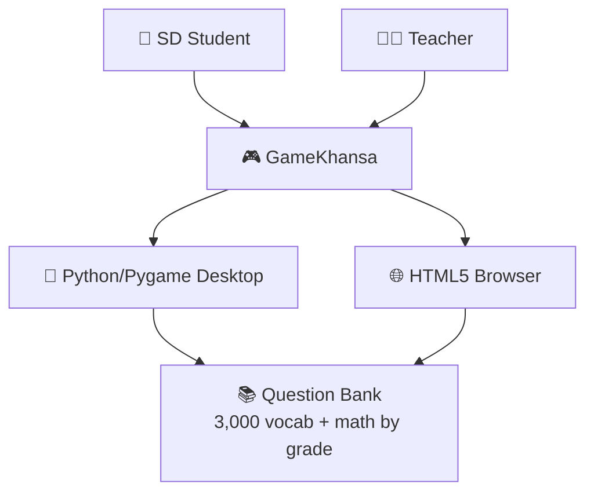
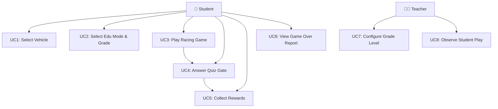

# 02 — Software Requirements Specification (SRS)
## GameKhansa (Mobil Legend) — Educational Racing Game

**Document Version:** 1.0  
**Date:** September 2026  
**Status:** Approved  

---

## 1. Introduction

### 1.1 Purpose
This Software Requirements Specification (SRS) defines all functional and non-functional requirements for GameKhansa (Mobil Legend), a dual-platform educational racing game for Indonesian SD students. It serves as the contractual baseline between development, educational design, and quality assurance teams.

### 1.2 Scope
GameKhansa encompasses:
- A Python/Pygame desktop application (`main.py` + `game/` package)
- A self-contained HTML5 browser application (`game_web.html`)
Both platforms share identical gameplay mechanics, educational content, and user experience.

### 1.3 Definitions and Abbreviations

| Term | Definition |
|------|-----------|
| SD | Sekolah Dasar — Indonesian Primary School (Grades 1–6) |
| Edu Mode | Educational Mode: MATH or VOCAB |
| Gate | Quiz portal spanning all 4 road lanes |
| Super Shield | 420-frame full immunity reward for correct gate |
| SUS | System Usability Scale |
| GEQ | Game Engagement Questionnaire |
| K-13 | Kurikulum 2013 |
| Merdeka | Kurikulum Merdeka (Merdeka Belajar) |
| HUD | Heads-Up Display |
| FPS | Frames Per Second |
| HP | Hit Points (player health) |

### 1.4 Overview
Section 2 provides overall system description. Section 3 lists functional requirements. Section 4 lists non-functional requirements. Section 5 presents use cases. Section 6 covers interface requirements.

---

## 2. Overall Description

### 2.1 Product Perspective
GameKhansa is a standalone product with no server-side dependencies, no internet requirement, and no user account system. It operates entirely on-device.



### 2.2 Product Functions Summary
1. Vehicle selection (4 cars + 1 tank)
2. Educational mode selection (Math or Vocab)
3. Grade/level selection (6 math grades; 3 vocab levels)
4. 4-lane racing with traffic avoidance
5. Quiz gate system with 4 answer options per gate
6. Impassable wrong-answer barrier with bounce-back
7. Super Celebration Reward for correct answers
8. HP, coin, and nitro/ammo resource systems
9. Score, distance, and high-score tracking
10. Biome/map system (3 environments)
11. Procedural SFX audio
12. Touch controls (HTML5 version)

### 2.3 User Characteristics

| User Class | Age | Technical Skill | Primary Goal |
|-----------|-----|----------------|-------------|
| SD Student (Grade 1–2) | 7–8 | Minimal | Play and have fun while learning |
| SD Student (Grade 3–4) | 9–10 | Basic | Improve math/vocab skills |
| SD Student (Grade 5–6) | 11–12 | Moderate | Master curriculum content; high score |
| Classroom Teacher | 25–50 | Moderate | Monitor learning; manage sessions |
| Parent | 25–50 | Varies | Ensure educational value; child safety |

### 2.4 Constraints
- Must run without internet connectivity
- HTML5 version must function without installation on Chrome ≥ 100, Firefox ≥ 100, Safari ≥ 15, Edge ≥ 100
- Python version requires Python ≥ 3.10 and pygame ≥ 2.5
- Screen resolution minimum: 1024 × 768 (game renders at 800 × 650 px)
- No collection of personally identifiable information
- All content appropriate for ages 7–12

---

## 3. Functional Requirements

### 3.1 Vehicle and Mode Selection

| ID | Requirement | Priority |
|----|-------------|----------|
| FR-001 | The system SHALL display a MENU screen with vehicle type selection (Mobil/Tank), grade/level selection, and Edu Mode selection | High |
| FR-002 | The system SHALL offer a GARAGE screen where players select from at least 4 car variants and 1 tank variant | High |
| FR-003 | The system SHALL display each vehicle's stats (speed, durability, special ability) in the garage | Medium |
| FR-004 | The system SHALL persist the selected vehicle across game sessions within a single launch | Low |
| FR-005 | The system SHALL allow educational mode toggle between MATH and VOCAB using keyboard key 'E' or tap on mode tab | High |
| FR-006 | The system SHALL allow grade/level selection: Kelas 1-2 / Kelas 3-4 / Kelas 5-6 (Math) or Level 1/2/3 (Vocab) | High |

### 3.2 Racing Mechanics

| ID | Requirement | Priority |
|----|-------------|----------|
| FR-007 | The system SHALL render a vertically scrolling 4-lane road with lane markings | High |
| FR-008 | The player vehicle SHALL respond to arrow keys (Up/Down/Left/Right) or WASD | High |
| FR-009 | The player SHALL be able to accelerate, decelerate, steer left/right, and reverse independently | High |
| FR-010 | The player vehicle SHALL collide with and take damage from traffic vehicles | High |
| FR-011 | Traffic vehicles SHALL spawn at configurable densities and speeds | High |
| FR-012 | The system SHALL render at least 3 biome/map environments with different visual themes | Medium |
| FR-013 | The system SHALL track and display distance traveled in km | Medium |
| FR-014 | The system SHALL include Coins, NitroBottles, RepairKits, OilSlicks, and RoadBlocks as road obstacles/collectibles | Medium |

### 3.3 HP and Resource Systems

| ID | Requirement | Priority |
|----|-------------|----------|
| FR-015 | The player SHALL have a HP (Hit Points) bar; game ends when HP reaches 0 | High |
| FR-016 | Collecting RepairKits SHALL restore HP by a defined amount | High |
| FR-017 | Collecting NitroBottles SHALL activate speed boost for car vehicles | High |
| FR-018 | Tank vehicles SHALL have a cannon with cooldown; Space bar fires shells at traffic | Medium |
| FR-019 | Coins SHALL accumulate and be displayed in the HUD | Medium |

### 3.4 Quiz Gate System — Impassable Barrier Mechanic

| ID | Requirement | Priority |
|----|-------------|----------|
| FR-020 | The system SHALL spawn a quiz gate spanning all 4 lanes every 8–10 seconds during gameplay | High |
| FR-021 | Each gate SHALL display the quiz question in a banner above the road | High |
| FR-022 | Each of the 4 lane portals SHALL display one answer option (one correct, three distractors) | High |
| FR-023 | When the player vehicle enters the CORRECT answer lane, the system SHALL immediately resolve the gate and trigger the Super Celebration Reward | High |
| FR-024 | When the player vehicle enters a WRONG answer lane, the system SHALL physically repel the vehicle backward (speed set to -3.5 px/frame) and mark that lane with a red ⛔ barrier | High |
| FR-025 | Wrong-answer lanes SHALL remain blocked (cannot be passed through) for at least 35 frames; the gate SHALL persist until the correct answer is chosen | High |
| FR-026 | The quiz banner SHALL display the question text in the appropriate language (math expression or English word to translate) | High |
| FR-027 | The system SHALL display feedback text ("🌟 CORRECT! / ⛔ LAJUR TERBLOKIR") after gate interaction | High |
| FR-028 | If a gate scrolls off-screen without being resolved, the system SHALL display "Terlewat!" feedback and generate a new gate | Medium |

### 3.5 Super Celebration Reward

| ID | Requirement | Priority |
|----|-------------|----------|
| FR-029 | On correct gate, the system SHALL activate a Rainbow Star Shield for 420 frames (~7 seconds) | High |
| FR-030 | During Super Shield, the player vehicle SHALL be immune to all damage from traffic collisions | High |
| FR-031 | During Super Shield, traffic vehicles SHALL be destroyed on contact ("Super Smash") with +250 score and +2 coins per smash | High |
| FR-032 | During Super Shield, road coins SHALL be attracted magnetically to the player vehicle within proximity radius | Medium |
| FR-033 | During Super Shield, RoadBlock obstacles SHALL be destroyed on contact | Medium |
| FR-034 | On correct gate, the system SHALL grant +35 coins, +50 HP, and a temporary max-speed boost | High |
| FR-035 | On correct gate, the system SHALL spawn 50 confetti particles in 6 colors | Medium |
| FR-036 | On correct gate, the system SHALL display a gold celebration banner for 150 frames | High |
| FR-037 | On correct gate, the system SHALL play victory fanfare + coin cascade SFX | High |
| FR-038 | On wrong gate, the system SHALL play a barrier-block SFX and spawn 16 red electric spark particles | Medium |
| FR-039 | The Super Shield SHALL render as a rainbow aura with 3 orbiting gold stars around the vehicle | Medium |

### 3.6 Scoring and Game Over

| ID | Requirement | Priority |
|----|-------------|----------|
| FR-040 | The system SHALL track and display a real-time score | High |
| FR-041 | Correct gate answers SHALL award +500 bonus score | High |
| FR-042 | Traffic Super Smash (during shield) SHALL award +250 score | Medium |
| FR-043 | The system SHALL track and persist a high score across sessions | High |
| FR-044 | Game ends when player HP reaches 0 | High |
| FR-045 | The GAMEOVER screen SHALL display final score, distance, correct answers, and accuracy % | High |
| FR-046 | The GAMEOVER screen SHALL display an educational report card (math or vocab) with grade/level title | High |

### 3.7 Audio

| ID | Requirement | Priority |
|----|-------------|----------|
| FR-047 | The system SHALL generate all SFX procedurally (no external audio files required) | High |
| FR-048 | SFX SHALL include: engine rev, collision, correct answer, wrong answer, barrier block, victory fanfare, coin cascade, nitro boost, explosion, coin pickup | High |
| FR-049 | HTML5 audio SHALL use Web Audio API with AudioContext synthesis | High |

### 3.8 HTML5-Specific Features

| ID | Requirement | Priority |
|----|-------------|----------|
| FR-050 | The HTML5 version SHALL include on-screen directional pad (D-pad) and action buttons for touch input | High |
| FR-051 | The HTML5 version SHALL function offline from a local file (no server required) | High |
| FR-052 | The HTML5 version SHALL function on Chrome, Firefox, Safari, and Edge without installation | High |

---

## 4. Non-Functional Requirements

| ID | Requirement | Target | Priority |
|----|-------------|--------|----------|
| NFR-001 | **Performance** — Game SHALL maintain 60 FPS with up to 10 traffic vehicles on screen | ≥60 FPS | High |
| NFR-002 | **Performance** — Game SHALL maintain ≥50 FPS with 50 confetti particles active | ≥50 FPS | High |
| NFR-003 | **Load Time** — Python game SHALL launch within 5 seconds on standard hardware | ≤5 sec | High |
| NFR-004 | **Load Time** — HTML5 game SHALL be fully interactive within 3 seconds of browser open | ≤3 sec | High |
| NFR-005 | **Usability** — System Usability Scale score SHALL be ≥80 (Excellent) | SUS ≥ 80 | High |
| NFR-006 | **Engagement** — Game Engagement Questionnaire overall score SHALL be ≥3.5/5 | GEQ ≥ 3.5 | High |
| NFR-007 | **Reliability** — The game SHALL not crash for 30 continuous minutes of gameplay | 0 crashes | High |
| NFR-008 | **Portability** — Python version SHALL run on macOS, Windows 10+, and Ubuntu 20.04+ | All 3 OS | High |
| NFR-009 | **Portability** — HTML5 version SHALL run on Chrome ≥100, Firefox ≥100, Safari ≥15, Edge ≥100 | 4 browsers | High |
| NFR-010 | **Security/Privacy** — The system SHALL collect NO personally identifiable information | Zero PII | High |
| NFR-011 | **Accessibility** — Minimum font size SHALL be 11px (HTML5) / 11pt (Python) for all in-game text | ≥11px | Medium |
| NFR-012 | **Maintainability** — All source modules SHALL have docstrings; constants SHALL be centralised | 100% modules | Medium |
| NFR-013 | **Educational** — All mathematics questions SHALL be verified against SD K-13/Merdeka curriculum | CVI ≥ 0.85 | High |
| NFR-014 | **Educational** — All vocabulary items SHALL be at appropriate CEFR level for their assigned tier | Level-validated | High |
| NFR-015 | **Filesize** — HTML5 single file SHALL be ≤250 KB | ≤250 KB | Medium |

---

## 5. Use Cases

### 5.1 Use Case Diagram



### 5.2 Detailed Use Cases

#### UC-001: Select Vehicle
| Field | Description |
|-------|-------------|
| **Actor** | Student |
| **Trigger** | Student presses 'G' or clicks GARAGE on menu |
| **Precondition** | Game is in MENU state |
| **Main Flow** | 1. System displays GARAGE screen with vehicle cards. 2. Student presses Left/Right arrow to browse. 3. System highlights selected vehicle with stats. 4. Student presses Enter/Space to confirm. 5. System returns to MENU with selected vehicle active. |
| **Alternative Flow** | Student presses Escape → returns to MENU without changing vehicle |
| **Postcondition** | Selected vehicle is stored; MENU shows new vehicle |

#### UC-002: Select Educational Mode and Grade
| Field | Description |
|-------|-------------|
| **Actor** | Student / Teacher |
| **Trigger** | Press 'E' (toggle mode) or '1'/'2'/'3' (grade/level) |
| **Precondition** | Game is in MENU state |
| **Main Flow** | 1. Press 'E' → toggles between MATH and VOCAB. 2. Press '1' → Grade 1-2 (MATH) or Level 1 (VOCAB). 3. Press '2' → Grade 3-4 / Level 2. 4. Press '3' → Grade 5-6 / Level 3. 5. System updates grade tabs visually. |
| **Postcondition** | Selected mode and grade/level applied to next game session |

#### UC-003: Play Racing Game
| Field | Description |
|-------|-------------|
| **Actor** | Student |
| **Trigger** | Press Space/Enter from MENU |
| **Precondition** | Vehicle and mode selected |
| **Main Flow** | 1. System transitions to PLAYING state. 2. Road scrolls; traffic spawns. 3. Student steers vehicle to avoid collisions and collect items. 4. Quiz gates appear every 8–10 seconds. 5. Game continues until HP = 0. |
| **Postcondition** | Score, distance, and correct answers tracked |

#### UC-004: Answer Quiz Gate — Correct Answer
| Field | Description |
|-------|-------------|
| **Actor** | Student |
| **Trigger** | Player vehicle enters the correct-answer lane of a gate |
| **Precondition** | Active gate displayed on screen; player vehicle overlaps correct lane |
| **Main Flow** | 1. Collision detected between vehicle and correct-lane portal. 2. System marks gate as resolved. 3. Super Celebration Reward triggered: shield 420f, +35 coins, +50 HP, speed boost, 50 confetti, gold banner 150f. 4. SFX: victory fanfare + coin cascade. 5. Score +500. 6. Edu correct count incremented. |
| **Postcondition** | Gate removed; next gate queued |

#### UC-005: Answer Quiz Gate — Wrong Answer
| Field | Description |
|-------|-------------|
| **Actor** | Student |
| **Trigger** | Player vehicle enters a wrong-answer lane of a gate |
| **Precondition** | Active gate displayed; player vehicle overlaps wrong lane |
| **Main Flow** | 1. Collision detected with wrong lane. 2. System adds lane to `blocked_lanes` (timer = 35f). 3. Vehicle speed set to -3.5 (bounce back). 4. Lane rendered with red ⛔ X cross. 5. SFX: barrier_block. 6. Red sparks emitted. 7. Gate persists — student must find correct lane. |
| **Postcondition** | Wrong lane blocked for 35 frames; gate remains active |

#### UC-006: Super Shield — Invincible Mode
| Field | Description |
|-------|-------------|
| **Actor** | Student (automatic trigger) |
| **Trigger** | Correct gate answer (FR-029) |
| **Precondition** | Correct gate resolved |
| **Main Flow** | 1. `super_shield_timer = 420`. 2. Rainbow aura + orbiting stars rendered on vehicle. 3. Traffic contacts → Super Smash (+250 score, +2 coins, explosion). 4. Coins attracted within radius. 5. RoadBlocks destroyed. 6. Timer counts down; shield ends at 0. |
| **Postcondition** | Vehicle returned to normal; timer = 0 |

#### UC-007: View Game Over Report
| Field | Description |
|-------|-------------|
| **Actor** | Student |
| **Trigger** | Player HP reaches 0 |
| **Precondition** | Game in PLAYING state |
| **Main Flow** | 1. System transitions to GAMEOVER state. 2. Screen displays: Final Score, High Score indicator, Distance, Correct Answers / Total Questions, Accuracy %. 3. Edu Report Card: Math grade/title or Vocab Level/title with achievement medal. 4. "SPACE: Play Again / M: Menu / G: Garage" prompts displayed. |
| **Postcondition** | High score updated if new record |

#### UC-008: Configure Grade Level (Teacher)
| Field | Description |
|-------|-------------|
| **Actor** | Teacher |
| **Trigger** | Teacher sets grade before student session |
| **Precondition** | Game in MENU state |
| **Main Flow** | 1. Teacher identifies student's grade level. 2. Presses '1', '2', or '3' to set grade tier. 3. Optionally toggles Edu Mode with 'E'. 4. Hands device to student. |
| **Postcondition** | Correct difficulty level applied for student's grade |

---

## 6. User Stories

| ID | As a... | I want to... | So that... |
|----|---------|-------------|-----------|
| US-001 | SD student | choose my favourite racing car | I feel personally invested in the game |
| US-002 | SD student | see the math question clearly before the gate | I have time to think about the answer |
| US-003 | SD student | get a spectacular reward when I answer correctly | I feel excited and motivated to answer more questions |
| US-004 | SD student | be blocked from passing a wrong gate | I am forced to find the right answer, not just drive through |
| US-005 | SD student | see how many words I got right at the end | I know how much I learned |
| US-006 | SD Grade 1 student | tap on-screen buttons (touch) | I can play even without a keyboard |
| US-007 | SD Grade 6 student | face harder questions | I am challenged at my actual level |
| US-008 | Teacher | quickly set the grade level before a session | Students get questions appropriate for their class |
| US-009 | Teacher | observe students answering without disruption | I can assess understanding during free play |
| US-010 | Parent | know the game covers actual school curriculum | My child is learning, not just playing |
| US-011 | Parent | trust the game is safe (no internet, no ads) | My child plays safely and without distractions |

---

## 7. Data Requirements

### 7.1 Question Bank Structure (Mathematics)
```python
MATH_QUESTIONS = {
    "grade_1_2": [
        {"text": "3 + 4 = ?", "options": [6, 7, 8, 9], "answer": 7},
        {"text": "10 - 5 = ?", "options": [4, 5, 6, 7], "answer": 5},
        # ... 200+ items
    ],
    "grade_3_4": [...],  # 200+ items: multiplication, division, fractions
    "grade_5_6": [...],  # 200+ items: geometry, percentages, equations
}
```

### 7.2 Vocabulary Bank Structure
```python
VOCAB_LEVEL_1 = [  # 1,000 words: everyday objects, colours, numbers, family
    {"en": "WATER", "id": "Air"},
    {"en": "SCHOOL", "id": "Sekolah"},
    # ...
]
VOCAB_LEVEL_2 = [...]  # 1,000 words: science, professions, nature
VOCAB_LEVEL_3 = [...]  # 1,000 words: abstract concepts, formal vocabulary
```

### 7.3 Player State (Runtime)
```python
player_state = {
    "hp": int,          # 0–100
    "max_hp": int,      # 100
    "speed": float,     # px/frame, -5.0 to max_speed
    "coins": int,       # cumulative
    "super_shield_timer": int,  # 0–420
    "nitro": float,     # 0.0–1.0
    "correct_answers": int,
    "total_questions": int,
}
score_state = {
    "score": int,
    "highscore": int,   # persisted in memory (session)
    "distance": int,    # px
}
```

---

## 8. Interface Requirements

### 8.1 Keyboard Controls (Both Platforms)
| Key | Action |
|-----|--------|
| ↑ / W | Accelerate |
| ↓ / S | Decelerate / Reverse |
| ← / A | Steer Left |
| → / D | Steer Right |
| Space | Fire cannon (Tank) / Activate Nitro (Car) |
| P | Pause / Resume |
| E | Toggle Edu Mode (Menu) |
| 1 / 2 / 3 | Grade/Level selection (Menu) |
| G | Open Garage (Menu) |
| M | Return to Menu (Game Over) |
| Esc | Pause or Return |

### 8.2 Touch Controls (HTML5 Only)
On-screen buttons: ↑ ↓ ← → (D-pad) + FIRE/NITRO button

### 8.3 Display Layout
- **Resolution:** 800 × 650 px
- **Top HUD (0–48px):** Score, Highscore, Coins, Distance, Map name
- **Question Banner (48–96px):** Current quiz question text
- **Feedback Banner (96–140px):** Gate response feedback
- **Celebration Banner (140–220px):** Gold reward popup (conditional)
- **Road Area (0–650px):** Racing gameplay canvas
- **Bottom Dashboard (530–630px, left):** Speed, HP bar, Nitro/Ammo bar, Shield bar

---

*Document version: 1.0 | Prepared: September 2026*
