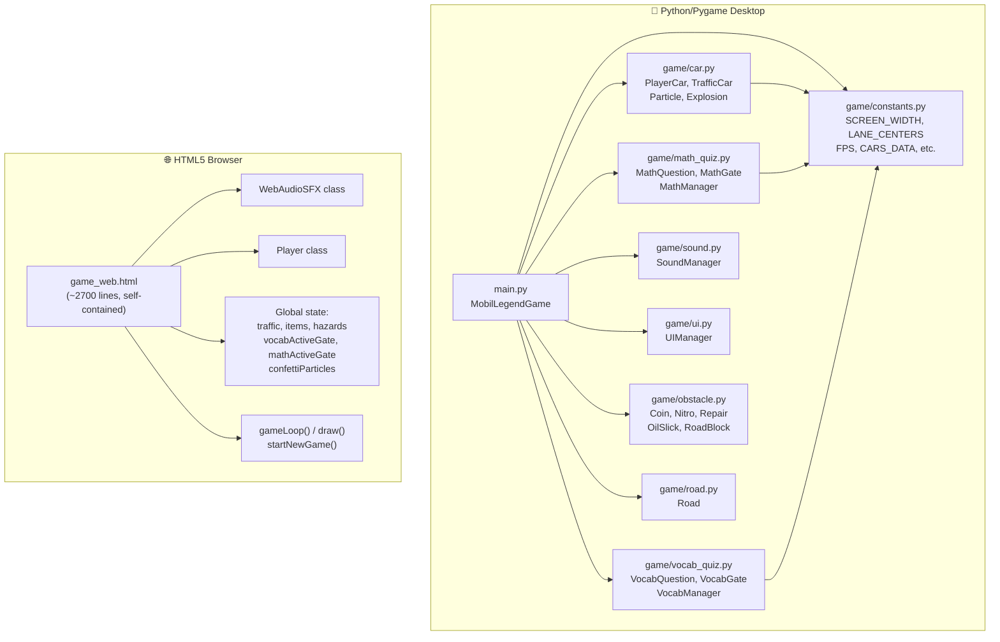
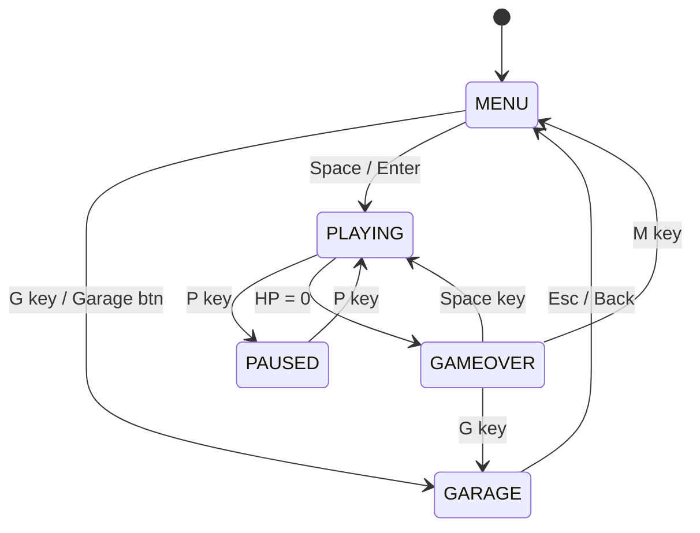
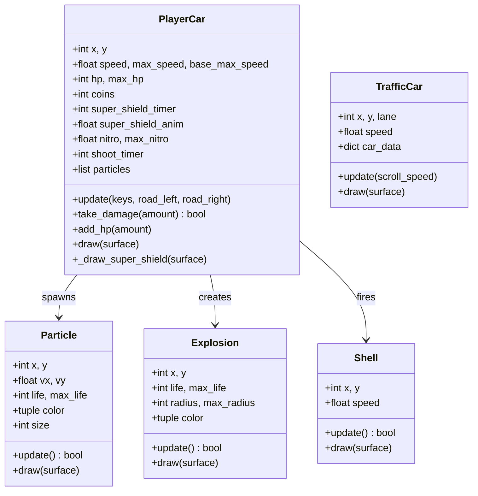
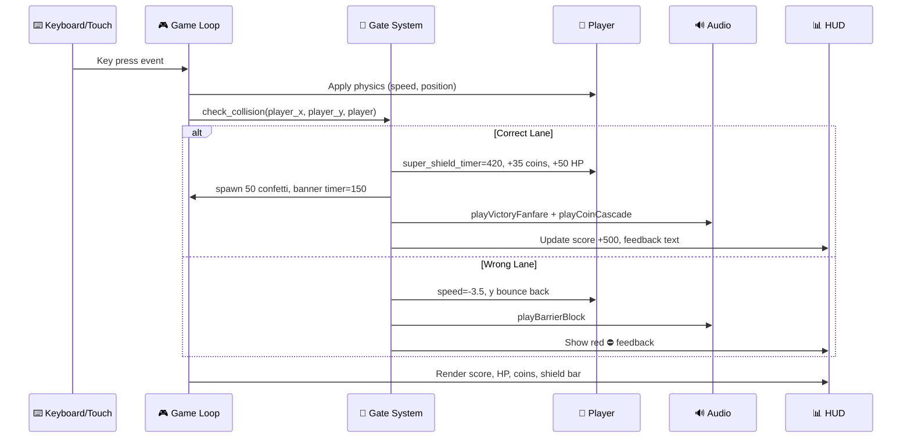
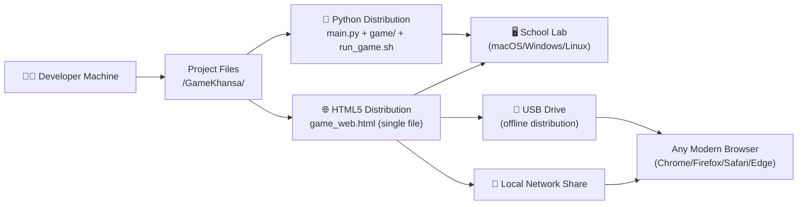

# 03 — System Architecture and Design (SDD)
## GameKhansa (Mobil Legend) — Educational Racing Game

**Document Version:** 1.0 | **Date:** September 2026

---

## 1. System Overview

GameKhansa is a dual-platform educational game with 100% feature parity:

| Platform | Technology | Entry Point | Size |
|----------|-----------|-------------|------|
| Desktop | Python 3.12 + pygame 2.6.1 | `main.py` | ~45 KB source |
| Browser | HTML5 + JavaScript ES2022 | `game_web.html` | ~201 KB |

Both platforms share: identical gameplay rules, same question bank content, same visual design language, and same educational mechanics.

---

## 2. High-Level Architecture



---

## 3. Python Module Descriptions

### 3.1 `main.py` — MobilLegendGame (Game Controller)
The central orchestrator. Manages the game loop and state machine.

| Component | Role |
|-----------|------|
| `MobilLegendGame.__init__()` | Initialise pygame, create all sub-managers, load constants |
| `run()` | Main loop: `clock.tick(FPS)` → `_handle_events()` → `_update()` → `_draw()` |
| `_handle_events()` | Keyboard/mouse event routing by game state |
| `_update()` | Per-frame logic: vehicle physics, traffic, items, gates, particles |
| `_draw()` | Per-frame rendering: road → obstacles → vehicles → particles → HUD → overlays |
| `_draw_celebration_banner()` | Render gold reward popup banner |
| `start_new_game()` | Reset all mutable state for a new game session |
| `ConfettiParticle` (nested class) | Confetti physics: spawn at road top, fall, rotate, fade |

**State Machine:**


### 3.2 `game/car.py` — Vehicle Classes



**Key PlayerCar attributes:**
- `super_shield_timer` (int, 0–420): counts down each frame; >0 = invincible
- `super_shield_anim` (float): increments each frame for color cycling
- `take_damage()`: returns `False` immediately if `super_shield_timer > 0`

### 3.3 `game/math_quiz.py` — Math Gate System

| Class | Key Attributes | Key Methods |
|-------|---------------|-------------|
| `MathQuestion` | `text`, `options[]`, `correct_answer`, `grade_level` | — |
| `MathGate` | `y`, `question`, `blocked_lanes{}`, `anim_tick`, `resolved` | `update()`, `check_collision(px, py, player)`, `draw(surface, fonts)` |
| `MathManager` | `active_gate`, `question_pool[]`, `correct_count`, `total` | `update(player, scroll)`, `_handle_answer(is_correct, player)`, `spawn_gate()` |

**Gate Collision Logic:**
```python
def check_collision(self, player_x, player_y, player_car=None):
    if abs(player_y - self.y) < 22:
        closest_lane = min(range(NUM_LANES), key=lambda i: abs(player_x - LANE_CENTERS[i]))
        if str(self.question.options[closest_lane]) == str(self.question.correct_answer):
            self.resolved = True
            return {"hit": True, "correct": True}
        else:
            if closest_lane not in self.blocked_lanes:
                self.blocked_lanes[closest_lane] = 35
                if player_car:
                    player_car.y = max(player_car.y, self.y + 42)
                    player_car.speed = -3.5
            return {"hit": True, "correct": False, "blocked": True}
    return {"hit": False}
```

### 3.4 `game/vocab_quiz.py` — Vocabulary Gate System

Mirrors `math_quiz.py` architecture. Additionally manages:
- `VOCAB_BANK`: 3,000 word pairs structured in 3 levels
- `VocabQuestion`: `source_word` (English), `options[]` (4 Indonesian translations), `correct_answer`
- Level-aware question pool selection and distractors sampled from same level

### 3.5 `game/sound.py` — Procedural Audio Synthesis

All SFX are generated mathematically at runtime. No audio files bundled.

| SFX Name | Synthesis Method | Waveform |
|----------|-----------------|----------|
| `engine_rev` | Frequency-modulated sine | Variable-freq sine |
| `collision` | White noise burst | Random noise |
| `math_correct` | C major arpeggio | Triangle wave |
| `math_wrong` | Descending dissonant interval | Sawtooth |
| `barrier_block` | Sawtooth sweep down | Sawtooth |
| `victory_fanfare` | C5→E6 ascending fanfare | Triangle + harmonics |
| `coin_cascade` | B5→E7 rapid sequence | Sine |
| `nitro_boost` | Rising sine glissando | Sine |
| `explosion` | Noise + low rumble | White noise |

### 3.6 `game/constants.py` — Centralised Constants

```python
SCREEN_WIDTH = 800
SCREEN_HEIGHT = 650
ROAD_LEFT = 160
ROAD_RIGHT = 640
NUM_LANES = 4
LANE_WIDTH = 120
LANE_CENTERS = [200, 320, 440, 560]  # x-centres of 4 lanes
FPS = 60
EDU_MODE_MATH = "MATH"
EDU_MODE_VOCAB = "VOCAB"
COLOR_GOLD = (255, 215, 0)
COLOR_NITRO_CYAN = (0, 229, 255)
```

---

## 4. HTML5 Architecture (`game_web.html`)

Single-file architecture for zero-dependency browser deployment.

| Section | Lines (approx) | Content |
|---------|---------------|---------|
| HTML/CSS | 1–80 | Canvas, layout, touch button styling |
| WebAudioSFX class | 81–490 | Procedural SFX: 12+ methods |
| Constants & Data | 491–700 | LANE_CENTERS, CARS_DATA, VOCAB/MATH banks |
| Player class | 701–1100 | Constructor, update(), takeDamage(), draw() |
| Game state globals | 1101–1420 | traffic, items, hazards, gate vars, confetti |
| Game loop | 1421–1920 | Collision handling, spawning, gate logic |
| draw() function | 1921–2290 | Road, gates, vehicles, HUD, overlays |
| Menu/Garage/GameOver | 2291–2702 | Screen rendering, touch controls |

**Key HTML5 Player properties:**
```javascript
this.superShieldTimer = 0;   // 0–420
this.superShieldAnim = 0;    // color cycling float
this.hp = 100;
this.maxHp = 100;
this.coins = 0;
this.speed = 0;
```

---

## 5. Data Flow Diagram



---

## 6. Python vs HTML5 Parity Comparison

| Feature | Python/Pygame | HTML5/Canvas | Parity |
|---------|--------------|--------------|--------|
| Gate impassable barrier | ✅ `blocked_lanes` dict | ✅ `blockedLanes` dict | 100% |
| Super Shield (420f) | ✅ `super_shield_timer` | ✅ `superShieldTimer` | 100% |
| Rainbow aura rendering | ✅ HSB pygame circles | ✅ HSL canvas arc | 100% |
| Orbiting gold stars | ✅ `math.cos/sin` polygon | ✅ `Math.cos/sin` arc | 100% |
| Confetti particles | ✅ `ConfettiParticle` class | ✅ `confettiParticles[]` | 100% |
| Celebration banner | ✅ `_draw_celebration_banner()` | ✅ inline `draw()` block | 100% |
| Victory fanfare SFX | ✅ SDL synthesis | ✅ Web Audio API | 100% |
| Coin magnet | ✅ proximity loop | ✅ proximity loop | 100% |
| Super Smash traffic | ✅ shield check in traffic loop | ✅ shield check in traffic loop | 100% |
| Touch controls | ❌ Keyboard only | ✅ On-screen D-pad | HTML5+ |
| Shield HUD bar | ✅ pygame draw | ✅ canvas fillRect | 100% |
| animTick sparkles | ✅ `anim_tick` in gate | ✅ `animTick` in gate | 100% |

---

## 7. Deployment Architecture



---

*Document version: 1.0 | September 2026*
